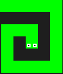
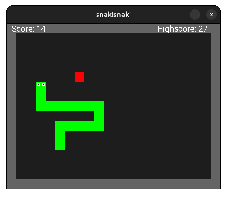

# Snake Game

> 

Snake game I made in rust using sdl2 because I wanted to\
learn a bit of sdl2 :D

This was made following this [guide](https://blog.logrocket.com/using-sdl2-bindings-rust/)

## How to run

1. Install [rust](https://www.rust-lang.org/tools/install) and [sdl2](https://wiki.libsdl.org/SDL2/Installation) for your corresponding OS
2. Then, use ```cargo run``` and you are ready to go

## Controls

<kbd>←</kbd><kbd>↑</kbd><kbd>→</kbd><kbd>↓</kbd> to move the snake and <kbd>Space</kbd> to toggle pause and to start and restart the game.



## Features

- [x] Audio and sounds from [pixabay](pixabay.com).
- [x] Restart game when you die.
- [x] Highscore display.
- [ ] Hard mode.
